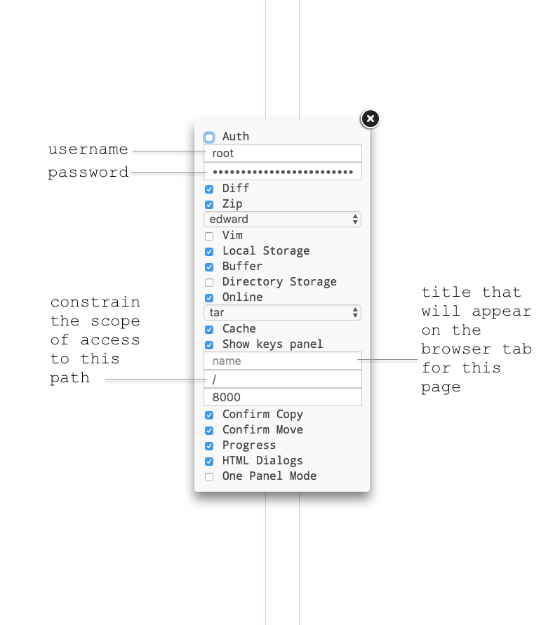

Here, we explain the setup required on the servers' end to get your site (or sites) up and running.

Here’s what you got to do,

- Create a droplet on DigitalOcean that has Apache and PHP pre-installed
<!-- - Install Composer -->
- Install NodeJS
- Install and setup Cloud Commander
- Scaffold the directory structure

**Apache** is the server software that listens for incoming communication to your website over the internet and then delegates that request. It is like a waiter in a restaurant.

**PHP** is language and runtime environment on which you can program and do things. It works alongside Apache to process the request. It is like the chef that receives the order from the waiter and fulfills it.

<!-- **Composer** is a package manager for PHP. Your may use packages to aid in your development of certain features on a website. -->

**Cloud Commander** is a file manager GUI along the lines of Explorer on Windows and Finder on MacOS. This is so that non-devs can easily plonk in media assets for the websites.

**NodeJS** is the runtime environment on which Cloud Commander runs.


All the instructions that follow are to be performed on a terminal on the server that you get to by SSH-ing onto it.


# Motivating Example
Assume you are creating a website for a real-estate developer "The Examples".
Their website ( https://example.com/ ) has a listing of all their projects. Clicking on any of them takes you a website dedicated solely to that project.
For example, clicking on the project "Outstanding" takes you to Outstanding's website ( https://example.com/outstanding ).


# Directory Structure
The individual project websites are children to "XYZ"'s website.

This is how the directory structure on the server should be.

```
├── /var/www/ 			( document root )
    ├── html/ 			( XYZ's website, linking to all the projects )
    ├── outstanding/ 		( Outstanding's website will be stored here )
    ├── mediocurry/ 		( Mediocurry's website will be stored here )
    ├── not-bad-bad/ 		( Not Bad Bad's website will be stored here )
    ├── .....
    ├── code-repo/ 		( not to be exposed to the public )
    ├── media/ 			( contains all media assets, not to be exposed directly to the public )
    ├── xyz/ 			( not to be exposed to the public )
    └── .htaccess 		( this is responsible for URL routing )
```

The `.htaccess` file that enables this structure is in the `DocumentRoot` folder here in this repository. Copy that onto the `/var/www/` directory of your server.


# Apache
**Virtual hosting** is a mechanism by which we can host multiple websites on a single physical server. Apache has this feature.

By default, Apache has one virtual-host in operation.
We need to disable that one, and add our own.

You can find the name of the default virtual-host configuration file at `/etc/apache2/sites-enabled/`. We'll need this in a moment.

There's a virtual-host config file ( in the `Apache` directory _in this repo_ ) that you have to plonk at `/etc/apache2/sites-available/` _on the server_. You can rename it to whatever. Then,
```
a2dissite <default-virtual-host-config-file>	# what is already there in the folder
a2ensite <your-virtual-host-config-file>		# what you just put in
```

You can restart Apache now or later with,
```
systemctl restart apache2
```


# Routing
The `.htaccess` file routes incoming URLs like so:

1. If the URL starts with the project name ( for example, http://example.com/not-bad-bad/... ), that route is by default delegated to that project's folder.
2. If the URL starts with anything but a project name ( for example, http://example.com/stylesheets/... ), then the route is delegated to the `html` directory.

For example,
```
/ → /html/index.php
/css/style.css → /html/css/style.css

/not-bad-bad/ → /not-bad-bad/index.php
```

Each project folder _can_ have its own `.htaccess` file. A route that is delegated to the project folder is then further handled by this `.htaccess` file.

To allow `.htaccess` files to do routing,
```
a2enmod rewrite
```


# Adding a new project
When a new project is to be hosted on the server, duplicate the line ( you'll know when you see it ) in the `.htaccess` file, and change the text to correspond to the folder name where this project's files will be stored.


## Install NodeJS
To install the most recent version of nodeJS, consult [this link](https://nodejs.org/en/download/package-manager/#debian-and-ubuntu-based-linux-distributions "Installing nodeJS via package manager") for up to date steps.

Here’s a [clip](https://asciinema.org/a/VoVQUVKM78YfqMKuCsj1Jrf95) showing the steps ( this installs version 9 ),

This installs version 9 of nodeJS,
```bash
curl -sL https://deb.nodesource.com/setup_9.x | sudo -E bash -
sudo apt-get install -y nodejs
```

## Install and setup Cloud Commander
Run the following commands,
```bash
npm install -g cloudcmd
```

Once done, run
```bash
cloudcmd
```

It should mention a URL on which it can be accessed, for example `http://localhost:8000/`. But you won’t be able to access this URL from your browser, yet. So, to make sure that it is working, run
```bash
curl localhost:8000
```
and you should get a dump containing quite a bit of markup; which means it is at least running, if not working.

Now for you to be able to access it, we’re gonna have to configure Apache to reverse proxy the local server.

Now, depending on whether or not you have linked your website domain name to your server or not, the procedures will differ.

### Domain and Server are not linked
Assuming that the URL on which Cloud Commander will be accessible is,
`http://ip.ad.dre.ss/fm`
and that Cloud Commander is running on port 8000.

First, make sure these proxy modules of Apache are enabled,
```
a2enmod proxy
a2enmod proxy_http
```

Then, you can check out this [clip](https://asciinema.org/a/ue3f5BjlK8KIC0oaiDVHsGj2a) or continue on for the handwritten version.

### Domain and Server are linked
Assuming that the URL on which Cloud Commander will be accessible is,
http://fm.website.tld/
and that Cloud Commander is running on port 8000.

You can check out the clip below or continue on for the handwritten version.
( todo )


Access Cloud Commander through your web browser, and configure the following settings,



Now, you cannot have Cloud Commander running like that the way it is obviously. It needs to
be running in the background ( a daemon process )
restart if ever it errors out
launch on system startup

Enter PM2.

PM2 is a process manager for nodeJS that provides a simple abstraction over systemd and other native utilities that are collectively used to achieve the three requirements mentioned above.

Q. Do I need this for Apache as well?
A. Nope. When Apache is installed, it elevates itself to a daemon process, and registers itself to launch on system startup.

Back to PM2, you install it like this,
```bash
npm install -g pm2
```


Then you launch Cloud Commander with PM2 like a so,
( if your domain and server are not linked ),
```bash
pm2 start cloudcmd --name="file manager" -- --prefix /fm
```

( if your domain and server are linked ),
```bash
pm2 start cloudcmd --name="file manager"
```


Then, run
```bash
pm2 startup
```
and now you’re set.


---
# References
[How To Use Apache as a Reverse Proxy | Mateusz Papiernik](https://www.digitalocean.com/community/tutorials/how-to-use-apache-as-a-reverse-proxy-with-mod_proxy-on-ubuntu-16-04)


---
# UNSORTED

## Install Composer
For installing Composer, you have to refer to [this](https://getcomposer.org/download/).

This is because the exact steps for installing change with every new version that is out. And the old steps won’t work anymore. You’ll understand when you see it.

The only thing to alter in the provided instructions is this statement:
php composer-setup.php
Make it this instead:
```bash
php composer-setup.php --install-dir=/usr/bin --filename=composer
```

Finally, as per good practice, run
```bash
which composer
```
to make sure that it is indeed installed. The response you should get is /usr/bin/composer.

Anywho, here’s a [clip](https://asciinema.org/a/l8H5Ybg2rrxyrVSRgGZvpvyJE) showing the installation process.
